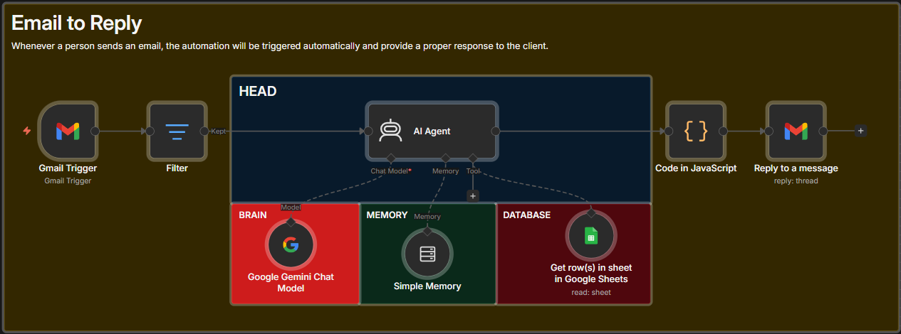

# Sadia AI: Autonomous Email Assistant for Maheer 🚀

Sadia is a sophisticated AI-powered Email Assistant designed to handle professional communications on behalf of **Sheikh Mohammad Ali Maheer**. Built using **n8n**, **Google Gemini 1.5 Flash**, and **Google Sheets**, this agent acts as a first responder to business inquiries, providing accurate information about services, pricing, and portfolio.

## 🌟 Key Features

-   **Autonomous Decision Making:** Uses Google Gemini to understand client intent and call tools as needed.
-   **Dynamic Database (RAG):** Fetches real-time pricing and service details from Google Sheets.
-   **Context-Aware Conversation:** Maintains thread memory (using Thread IDs) to handle follow-up emails seamlessly.
-   **Multilingual Support:** Automatically detects the sender's language (Bangla, English, Banglish) and mirrors their tone. 
-   **Safety & Filtering:** Built-in safety logic to handle inappropriate language or off-topic queries professionally.
-   **Structured JSON Output:** Custom JavaScript formatting to ensure email replies are sent in clean, professional HTML.

## 🏗️ Technical Architecture

The workflow is built on **n8n** and follows a modular architecture:

1.  **Gmail Trigger:** Polls for new messages and triggers the workflow.
2.  **Filter Node:** Prevents looping and handles internal email routing.
3.  **AI Agent (Brain):** Powered by Google Gemini 1.5 Flash with custom system prompts.
4.  **Memory Node:** Uses `Simple Memory` with `Thread ID` to track long conversations.
5.  **Google Sheets Tool:** Serves as the Knowledge Base for pricing and portfolio data.
6.  **Code Node:** A custom JavaScript formatter to parse JSON outputs for the Gmail API.
7.  **Gmail Reply Node:** Sends formatted HTML replies back to the client.

## 🛠️ Tech Stack

-   **Workflow Automation:** [n8n](https://n8n.io/)
-   **LLM Model:** Google Gemini 1.5 Flash
-   **Database:** Google Sheets (as a searchable knowledge base)
-   **Email Integration:** Gmail API
-   **Programming:** JavaScript 

## 📂 Project Structure

-   `Topic`: The category of inquiry (Pricing, Identity, Portfolio).
-   `Keywords`: Search tags for the AI to retrieve correct rows.
-   `Content`: The official response/data source for the AI.

## 🚀 Future Roadmap

-   [ ] Automatic Meeting Booking via Calendly API.
-   [ ] Integration with WhatsApp Business API.
-   [ ] Multi-user support for various team members.

## 👨‍💻 Developed By

**Sheikh Mohammad Ali Maheer** 
*AI Automation Engineer & Full Stack Developer*  
- [GitHub](https://github.com/maheerCodes)  
- [LinkedIn](https://linkedin.com/in/sheikh-mohammad-ali-maheer)

## 🚀 Quick Setup
1. **Import Workflow:** Download the `EmailWorkflows.json` and import it into your n8n instance.
2. **Setup Database:** Create a Google Sheet with `Topic`, `Keywords`, and `Content` columns.
3. **Configure API:** Add your Google Gemini API key and connect your Gmail account.
4. **Publish:** Activate the workflow and you are ready!

---
*Note: This project was built to demonstrate the power of AI Agents in automating professional workflows and scaling personal business communications.*

