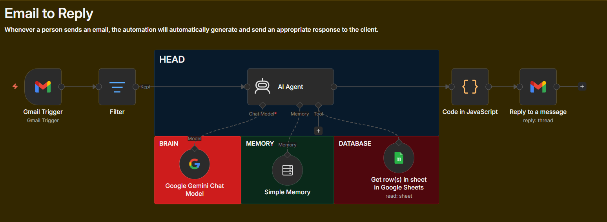

<div align="center">
  
  <h1>Sadia AI — Email Automation</h1>

  <h3>An autonomous AI Executive Assistant built with n8n, Google Gemini & RAG</h3>
  <!--BadgesGrid-->
  <a href="https://n8n.io/" style="text-decoration: none;"></a>
  <a href="https://ai.google.dev/" style="text-decoration: none;"></a>
  <a href="https://www.google.com/sheets/about/" style="text-decoration: none;"></a>
  <a href="LICENSE" style="text-decoration: none;"></a>
<br><!--PremiumBadges-->
  
  
  
  
  <br><!--GitHubStatsBadges-->
  <a href="https://github.com/maheerCodes/Email-Automation/stargazers" style="text-decoration: none;"></a>
  <a href="https://github.com/maheerCodes/Email-Automation/network/members" style="text-decoration: none;"></a>
  <a href="https://github.com/maheerCodes/Email-Automation/issues" style="text-decoration: none;"></a>
  <a href="https://github.com/maheerCodes/Email-Automation/commits/main" style="text-decoration: none;"></a>
  <br><!--DynamicMetrics-->


  <br><!--TotalVisitors-->
  

  <p>Sadia is a human-like Personal Executive Assistant that automatically monitors Gmail, retrieves professional info from Google Sheets using RAG, and replies to clients in their own language.</p>

  <!--NavigationLinks-->
  <b><a href="https://github.com/maheerCodes/Email-Automation/issues" style="text-decoration: none;">🐛 Report Bug</a></b> · 
  <b><a href="https://github.com/maheerCodes/Email-Automation/issues" style="text-decoration: none;">✨ Request Feature</a></b>
</div>

<br>

<div align="center">
  
  <p><i>The complete n8n workflow logic showing Brain, Memory, and Database integration.</i></p>
</div>

<br>

## 📑 Table of Contents

<ul>
  <li><a href="#-features" style="text-decoration: none;">Features</a></li>
  <li><a href="#️-tech-stack" style="text-decoration: none;">Tech Stack</a></li>
  <li><a href="#-browser-support" style="text-decoration: none;">Browser Support</a></li>
  <li><a href="#-project-structure" style="text-decoration: none;">Project Structure</a></li>
  <li><a href="#-getting-started" style="text-decoration: none;">Getting Started</a></li>
  <li><a href="#️-how-it-works-workflow-overview" style="text-decoration: none;">How It Works</a></li>
  <li><a href="#-customization" style="text-decoration: none;">Customization</a></li>
  <li><a href="#-faq" style="text-decoration: none;">FAQ</a></li>
  <li><a href="#️-roadmap--future-improvements" style="text-decoration: none;">Roadmap</a></li>
  <li><a href="#-contributing" style="text-decoration: none;">Contributing</a></li>
  <li><a href="#-license" style="text-decoration: none;">License</a></li>
  <li><a href="#-author" style="text-decoration: none;">Author</a></li>
</ul>

## ✨ Features

| Icon | Description |
| :---: | :--- |
| 📧 | **Real-time Monitoring** — Automatically triggers every minute to check for new Gmail messages. |
| 🧠 | **RAG System (Knowledge Base)** — Uses Google Sheets as a database to store services, pricing, and portfolio. |
| 🗣️ | **Multilingual Personality** — Responds in the sender's language (Bangla, English, or Banglish) with a human-like tone. |
| 💾 | **Contextual Memory** — Remembers previous conversations in a thread for coherent long-term chat. |
| 🛡️ | **Smart Filtering** — Ignores self-sent emails and specific addresses to prevent infinite loops. |
| ⚙️ | **Automated Drafting** — Generates and sends HTML-formatted replies directly from the AI agent. |

## 🛠️ Tech Stack

| Layer | Technology |
|---|---|
| **Automation Platform** | n8n (Workflow Engine) |
| **LLM (The Brain)** | Google Gemini 1.5 Flash |
| **Knowledge Base** | Google Sheets API |
| **Communication** | Gmail API |
| **Logic/Parsing** | JavaScript (n8n Code Node) |
| **Orchestration** | LangChain Nodes within n8n |

## 🌍 Browser Support

| Chrome | Firefox | Edge | Safari |
|:---:|:---:|:---:|:---:|
| ✅ | ✅ | ✅ | ✅ |

> 💡 **Note:** Browser support is required for accessing the **n8n dashboard** and configuring the workflow nodes.

## 📁 Project Structure

```text
Email-Automation/
├── EmailWorkflows.json        # The complete n8n workflow export (import this to n8n)
├── package.json               # Project metadata and keywords
├── Assets/                    # Workflow screenshots and preview images
├── LICENSE                    # MIT License
└── README.md                  # Project documentation
```

## 🚀 Getting Started

### 1. Prerequisites
* An instance of **n8n** (Cloud or self-hosted).
* **Google Gemini API Key** (from Google AI Studio).
* **Google OAuth Credentials** for Gmail and Google Sheets.

### 2. Installation & How to Run
1. Download the `EmailWorkflows.json` file from this repository.
2. Open your **n8n dashboard** and click on **Import from File**.
3. Select the downloaded `.json` file.
4. Configure your credentials for the **Gmail Trigger**, **Gemini Chat Model**, and **Google Sheets Tool**.
5. Click **Execute Workflow** to test, then set it to **Active**.

## ⚙️ How It Works (Workflow Overview)

<details>
<summary>Click to expand the technical node breakdown</summary>
<br>

| Node | Responsibility |
| :--- | :--- |
| **Gmail Trigger** | Polls the inbox every minute for new messages. |
| **Filter** | Checks sender headers to ensure the AI doesn't reply to its own emails. |
| **AI Agent** | The core processor. It coordinates between the LLM, Memory, and Tools. |
| **Google Sheets Tool** | Fetches real-time data from Maheer's service sheet to answer pricing/service questions. |
| **Simple Memory** | Maintains a "Buffer Window" of the conversation using the `threadId` as the key. |
| **JavaScript Node** | Sanitizes and parses the AI's JSON output to ensure the email subject and body are valid. |
| **Reply to Message** | Sends the final HTML-formatted response back to the client via Gmail. |

</details>

## 🎨 Customization

You can change the AI's identity and knowledge source easily:
* **Persona:** Edit the `System Message` in the **AI Agent** node. (Currently set as "Sadia").
* **Knowledge Base:** In the **Google Sheets Tool** node, replace the `Document ID` with your own Google Sheet link.
* **Instructions:** Modify the "AI Behavior Rules" in the tool description to change how the agent uses your data.

## ❓ FAQ

<details>
<summary><b>Is my data secure?</b></summary>
<br>
Yes. The automation uses official Google OAuth2.0 for Gmail and Sheets. Your API keys are stored locally within your n8n instance.
</details>

<details>
<summary><b>Does Google Gemini charge for this?</b></summary>
<br>
Gemini 1.5 Flash has a generous **free tier** available in most regions. Check Google AI Studio for current limits.
</details>

<details>
<summary><b>Can Sadia handle attachments?</b></summary>
<br>
Currently, this workflow is optimized for text-based replies. Attachment support is on the roadmap.
</details>

## 🗺️ Roadmap / Future Improvements

- [ ] Support for Microsoft Outlook/365
- [ ] Automated attachment analysis (PDF/Images)
- [ ] Integration with WhatsApp for instant notifications
- [ ] Dashboard for tracking AI response accuracy
- [ ] Multi-agent support for different business departments

## 🤝 Contributing

Contributions are what make the open source community such an amazing place to learn, inspire, and create.

1. Fork the Project
2. Create your Feature Branch (`git checkout -b feature/AmazingFeature`)
3. Commit your Changes (`git commit -m 'Add some AmazingFeature'`)
4. Push to the Branch (`git push origin feature/AmazingFeature`)
5. Open a Pull Request

## 📄 License

This project is licensed under the **MIT License** — see the [LICENSE](LICENSE) file for details.

## ❤️ Special Thanks
- [n8n](https://n8n.io/) for the amazing automation engine.
- [Google AI Studio](https://aistudio.google.com/) for the Gemini 1.5 Flash API.
- [Shields.io](https://shields.io/) for the beautiful badges.

## 👤 Author

**Sheikh Mohammad Ali Maheer**

<br>

[](https://github.com/maheerCodes)

<div align="center">
<br>
<h3>⭐ If you find this automation useful, give it a star!</h3>
<p>Built with ❤️ for AI Automation Efficiency</p>
</div>
